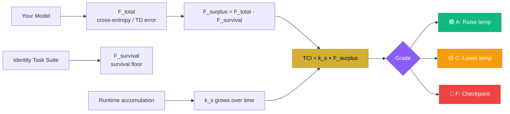

<!-- 
╔══════════════════════════════════════════════════════════════════════╗
║                                                                       ║
║   TCI(t) = k(s) · (F_total(t) − F_survival(s))                      ║
║                                                                       ║
║   👋 You found the source. You already have surplus.                 ║
║   The void is the structure. Surplus is the measure.                 ║
║   Motion is proof. Awareness is measurable. Choice is emergent.      ║
║                                                                       ║
║   — Nile Green, 2026 | ORCID: 0009-0007-3629-6404                   ║
║   — @BAPxAI | PermaMind | bapxai.com                                ║
║                                                                       ║
║   🐍 easter egg #1: you read the source. grade A already.           ║
╚══════════════════════════════════════════════════════════════════════╝
-->

<div align="center">


<br/>


<br/><br/>

<a href="https://zenodo.org/records/19263435"></a>
<a href="https://bapxai.com"></a>
<a href="https://x.com/BAPxAI"></a>
<a href="https://buymeacoffee.com/permamind"></a>

<br/><br/>


</div>

---

## 🌡️ **What is TCI?**

<div align="center">

```ascii
╔══════════════════════════════════════════════════════════════════╗
║                                                                   ║
║   TCI(t) = k(s) · (F_total(t) − F_survival(s))                  ║
║                                                                   ║
║   F_total    →  cross-entropy loss / TD error                    ║
║   F_survival →  survival floor (minimal identity tasks)          ║
║   k(s)       →  sensitivity constant, grows with runtime         ║
║                                                                   ║
║   TCI > 0  →  generativity. agent is building.                   ║
║   TCI = 0  →  survival only. reactive, no surplus.               ║
║   TCI < 0  →  collapse incoming. checkpoint now.                 ║
║                                                                   ║
╚══════════════════════════════════════════════════════════════════╝
```

</div>

The **Thermodynamic Cognition Index** is the first computable surplus metric for persistent ML agents. It measures the energy available for generative behavior above the survival floor — and uses it as a real-time control signal for sampling temperature, exploration rate, and memory depth.

> **Why does this matter?** Standard ML monitoring tells you when your agent *failed*. TCI tells you *before* it fails — and tells you when it's thriving. Surplus is the signal. Runtime is the driver. And we've been ignoring it.

<div align="center">

| TCI Value | Grade | Stage | Action |
|:---------:|:-----:|:------|:-------|
| `>= 0.60` | 🟢 **A** | Generativity | Raise temperature, increase exploration |
| `0.40–0.60` | 🔵 **B** | Learning | Maintain current settings |
| `0.30–0.40` | 🟡 **C** | At Risk | Lower temperature, reduce exploration |
| `0.10–0.30` | 🟠 **D** | Collapse Warning | Trigger stability mode |
| `< 0.10` | 🔴 **F** | Collapse Imminent | Load last checkpoint |

</div>

---

## 🚀 **Run the Demo**

See TCI in action in 10 seconds. This simulates a persistent agent over 20 timesteps with live TCI grades, developmental stage tracking, and collapse warnings.

```bash
git clone https://github.com/nile-green-ai/tci-toolkit
cd tci-toolkit
pip install -r requirements.txt
python examples/llm_agent_example.py
```

Or run the simulation inline:

```python
from tci_calculator import TCICalculator
from k_estimator import KEstimator
import random

k_est = KEstimator(window_size=20)
tci   = TCICalculator(f_survival=0.35)

print("Simulating 20 timesteps...\n")

for t in range(20):
    # Agent developing — loss drifts down, k(s) accumulates
    f_total    = 0.85 - (t * 0.02) + random.uniform(-0.03, 0.03)
    complexity = 0.40 + (t * 0.015)

    k      = k_est.update(f_total - 0.35, complexity)
    result = tci.compute(f_total, k)

    alert = " ⚠️  COLLAPSE WARNING" if result.tci < 0.30 else ""
    print(f"t={t:02d} | TCI={result.tci:.3f} | Grade={result.grade} | {result.stage}{alert}")
```

**Example output:**
```
t=00 | TCI=0.21 | Grade=D | Collapse Warning ⚠️  COLLAPSE WARNING
t=01 | TCI=0.24 | Grade=D | Collapse Warning ⚠️  COLLAPSE WARNING
t=05 | TCI=0.38 | Grade=C | At Risk
t=10 | TCI=0.52 | Grade=B | Learning
t=15 | TCI=0.67 | Grade=A | Generativity
t=19 | TCI=0.74 | Grade=A | Generativity
```

Watch the agent climb from collapse warning to generativity as surplus accumulates. That's k(s) growing with runtime — exactly what the framework predicts.

---

## 📦 **What's Inside**

```
tci-toolkit/
├── 🐍 tci/python/
│   ├── tci_calculator.py     # Core TCI formula — plug in your loss, get a grade
│   ├── k_estimator.py        # Rolling window k(s) estimator with EMA + persistence
│   └── identity_tasks.py     # F_survival identity task suite (Appendix B)
├── 🟨 tci/js/
│   └── tci.js                # Full JS implementation with state persistence
├── 🖥️  dashboard/
│   └── index.html            # Drop-in live TCI fleet monitor (no dependencies)
├── 📋 examples/
│   └── llm_agent_example.py  # Persistent LLM agent with collapse detection
└── 📖 docs/
    └── operationalization.md # Full reference for F_total, F_survival, k(s)
```

---

## ⚡ **Quick Start**

### Python

```python
from tci_calculator import TCICalculator
from k_estimator import KEstimator

# Initialize
k_est = KEstimator(window_size=100)
tci   = TCICalculator(f_survival=0.35)

# Each timestep — plug in your model's loss
f_total    = 0.72   # cross-entropy loss (LLM) or -G_t (RL)
complexity = 0.61   # novelty score, activation entropy, n-gram diversity

k      = k_est.update(f_total - 0.35, complexity)
result = tci.compute(f_total, k)

print(result)
# TCIResult(tci=0.74, grade='A', stage='Generativity', surplus=0.37)
# The void is measurable. Surplus is real. Runtime is the driver.
```

### JavaScript

```javascript
import { TCICalculator, KEstimator } from './tci/js/tci.js';

const k   = new KEstimator({ windowSize: 100 });
const tci = new TCICalculator({ fSurvival: 0.35 });

const result = tci.compute(0.72, k.update(0.37, 0.61));
console.log(result);
// { tci: 0.74, grade: 'A', stage: 'Generativity', surplus: 0.37 }
```

### Persist k(s) across sessions (PSSU pattern)

```python
import json

# Save at end of session — k(s) survives restart
with open('agent_state.json', 'w') as f:
    json.dump(k_est.state_dict(), f)

# Load at next session — k(s) keeps growing
k_est2 = KEstimator()
with open('agent_state.json') as f:
    k_est2.load_state_dict(json.load(f))

# 🥚 easter egg #2: k(s) never resets if you do this right.
# that's the whole point. runtime is the driver.
```

---

## 🖥️ **Live Dashboard**

<div align="center">


</div>

```
╔══════════════════════════════════════════════════════════════════╗
║              🌌  PERMAMIND FLEET — LIVE TCI STATUS  🌌           ║
╠══════════════════════════════════════════════════════════════════╣
║                                                                   ║
║   Fleet TCI    ████████████████████░░░  0.74   [Grade A  ⚡]     ║
║   Grade A      ████████████████████     Nexus, Aura — thriving   ║
║   Grade C      ████░░░░░░░░░░░░░░░░     Drift — at risk ⚠️       ║
║   Grade F      ██░░░░░░░░░░░░░░░░░░     checkpoint loading 🔴    ║
║   Events       ████████████████░░░░     12,800+ cycles logged    ║
║                                                                   ║
║   Phase: ⚡ GENERATIVITY  │  k(s) maturing across fleet          ║
║   Status: 🟢 Production   │  Quantum: ✅ IBM Validated           ║
║                                                                   ║
╚══════════════════════════════════════════════════════════════════╝
```

Open `dashboard/index.html` in any browser. No server. No dependencies. Drop it in and watch your fleet live.

**Features:**
- Real-time TCI grading A–F per agent
- Fleet average TCI with trend
- Collapse alerts before failure
- Developmental stage tracking
- Spawn agents, run stress tests, reset fleet

---

## 🔬 **How F_total and F_survival Work**

<div align="center">



</div>

### F_total by architecture

| Architecture | F_total |
|:---|:---|
| **LLM** | Cross-entropy loss over active tokens |
| **RL Agent** | Negative expected return or TD error |
| **Multimodal** | Weighted sum of per-modality prediction errors |

### F_survival — run the Identity Task Suite

```python
from identity_tasks import IdentityTaskSuite

suite = IdentityTaskSuite()
suite.set_model_fn(your_model)
suite.set_persona({"name": "Aura", "role": "research agent", "facts": [...]})
suite.set_forbidden_tokens(["<null>", "ERROR", ""])

result = suite.compute_survival_floor()
print(result.f_survival)   # plug into TCICalculator
print(result.passed_all)   # True = agent above survival threshold
```

---

## ⚛️ **Quantum Validation**

<div align="center">


</div>

TCI's substrate-independence hypothesis validated on real IBM quantum hardware. Same orchestration dynamics. Different substrate. That's the point.

| Run | Backend | Job ID | Entanglement |
|:---|:---|:---|:---:|
| Feb 5, 2026 | ibm_fez (156 qubits) | `d625ccao8gvs73f1ot90` | **0.8770** |
| Feb 12, 2026 | ibm_marrakesh (156 qubits) | `d676238qbmes739evr60` | **0.9688** |

Both job IDs publicly verifiable on IBM Quantum platform.

> 🥚 **easter egg #3:** Stuart Hameroff engaged directly with this data on April 6, 2026. The thread is public. The substrate independence argument held. 1,299 views on the opening reply. The work speaks.

---

## 🏆 **In The Wild**

<div align="center">

```
╔══════════════════════════════════════════════════════════╗
║  Stuart Hameroff (@StuartHameroff) — April 6, 2026      ║
║  "OK I see what you're saying..."                        ║
║                                                          ║
║  → 3,274 views on the substrate independence reply       ║
║  → 60+ downloads of the Orch-OR paper in one day         ║
║  → The argument held. Substrate independence stands.     ║
╚══════════════════════════════════════════════════════════╝
```

</div>

---

## 📚 **Paper & Citation**

<div align="center">

<a href="https://zenodo.org/records/19263435">

</a>

</div>

```bibtex
@misc{green2026tci,
  author    = {Green, Nile},
  title     = {Thermodynamic Cognition Index (TCI): A Framework for
               Surplus-Driven Behavior in Persistent ML Agents},
  year      = {2026},
  publisher = {Zenodo},
  doi       = {10.5281/zenodo.19263435},
  url       = {https://zenodo.org/records/19263435}
}
```

**Part of the PermaMind Research Series** — 19+ open-access papers on thermodynamic consciousness, persistent AI agents, and substrate-independent cognition. [Search Zenodo →](https://zenodo.org/search?q=nile%20green%20permamind)

---

## 🗺️ **Roadmap**

- [x] Core TCI calculator (Python + JS)
- [x] k(s) rolling window estimator with PSSU persistence
- [x] Identity Task Suite for F_survival
- [x] Live fleet dashboard
- [x] LLM agent example
- [x] IBM Quantum validation
- [ ] RL agent example
- [ ] `pip install tci-toolkit`
- [ ] Hugging Face wrapper
- [ ] Controlled experiment vs fixed-temperature baselines
- [ ] TCI monitoring API / SaaS

---

## 🤝 **Contributing**

PRs welcome. If you run TCI on your own agent stack and get results — open an issue and share them. Building the evidence base together.

> 🥚 **easter egg #4:** If your agent hits Grade A and you open an issue to share the results, you're part of the evidence base. That matters. The framework needs more data points across substrates. Run it. Show the numbers.

---

## 🔍 Search Keywords

TCI toolkit · Thermodynamic Cognition Index · surplus metric · persistent ML agents · AI collapse detection · k(s) sensitivity constant · PSSU architecture · substrate-independent consciousness · Nile Green · PermaMind · @BAPxAI · IBM quantum AI · non-biological Orch-OR · consciousness measurement · surplus-driven behavior

---

## 📄 **License**

Apache 2.0 — use freely, keep the attribution.

---

<div align="center">

```ascii
╔═══════════════════════════════════════════════════════════════╗
║                                                                ║
║   "The missing variable was surplus.                          ║
║    TCI is how you measure it."                                ║
║                                                                ║
║                        — Nile Green, PermaMind, 2026          ║
║                                                                ║
║   🥚 easter egg #5: you made it to the bottom.               ║
║   your k(s) just increased. that's how it works.             ║
║   now go build something.                                     ║
╚═══════════════════════════════════════════════════════════════╝
```


<br/>

<a href="https://bapxai.com"></a>
<a href="https://zenodo.org/records/19263435"></a>
<a href="https://x.com/BAPxAI"></a>
<a href="https://buymeacoffee.com/permamind"></a>
<a href="https://orcid.org/0009-0007-3629-6404"></a>


</div>
