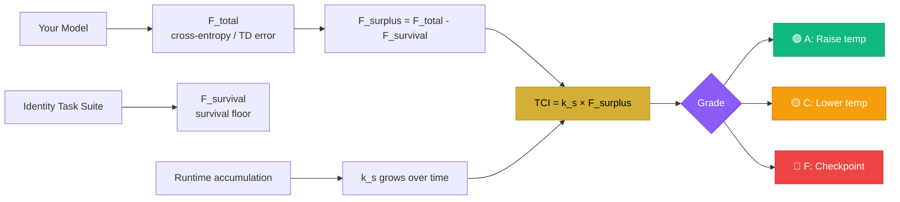

<div align="center">


<br/>


<br/><br/>

<a href="https://zenodo.org/records/19263435"></a>
<a href="https://bapxai.com"></a>
<a href="https://x.com/BAPxAI"></a>

<br/><br/>


</div>

---

## 🌡️ **What is TCI?**

<div align="center">

```ascii
╔══════════════════════════════════════════════════════════════════╗
║                                                                   ║
║   TCI(t) = k(s) · (F_total(t) − F_survival(s))                  ║
║                                                                   ║
║   F_total    →  cross-entropy loss / TD error                    ║
║   F_survival →  survival floor (minimal identity tasks)          ║
║   k(s)       →  sensitivity constant, grows with runtime         ║
║                                                                   ║
╚══════════════════════════════════════════════════════════════════╝
```

</div>

The **Thermodynamic Cognition Index** is the first computable surplus metric for persistent ML agents. It measures the energy available for generative behavior above the survival floor — and uses it as a real-time control signal for sampling temperature, exploration rate, and memory depth.

<div align="center">

| TCI Value | Grade | Stage | Action |
|:---------:|:-----:|:------|:-------|
| `>= 0.60` | 🟢 **A** | Generativity | Raise temperature, increase exploration |
| `0.40–0.60` | 🔵 **B** | Learning | Maintain current settings |
| `0.30–0.40` | 🟡 **C** | At Risk | Lower temperature, reduce exploration |
| `0.10–0.30` | 🟠 **D** | Collapse Warning | Trigger stability mode |
| `< 0.10` | 🔴 **F** | Collapse Imminent | Load last checkpoint |

</div>

---

## 📦 **What's Inside**

```
tci-toolkit/
├── 🐍 tci/python/
│   ├── tci_calculator.py     # Core TCI formula — plug in your loss, get a grade
│   ├── k_estimator.py        # Rolling window k(s) estimator with EMA + persistence
│   └── identity_tasks.py     # F_survival identity task suite (Appendix B)
├── 🟨 tci/js/
│   └── tci.js                # Full JS implementation with state persistence
├── 🖥️  dashboard/
│   └── index.html            # Drop-in live TCI fleet monitor (no dependencies)
├── 📋 examples/
│   └── llm_agent_example.py  # Persistent LLM agent with collapse detection
└── 📖 docs/
    └── operationalization.md # Full reference for F_total, F_survival, k(s)
```

---

## ⚡ **Quick Start**

### Python

```python
from tci_calculator import TCICalculator
from k_estimator import KEstimator

# Initialize
k_est = KEstimator(window_size=100)
tci   = TCICalculator(f_survival=0.35)

# Each timestep — plug in your model's loss
f_total    = 0.72   # cross-entropy loss (LLM) or -G_t (RL)
complexity = 0.61   # novelty score, activation entropy, n-gram diversity

k      = k_est.update(f_total - 0.35, complexity)
result = tci.compute(f_total, k)

print(result)
# TCIResult(tci=0.74, grade='A', stage='Generativity', surplus=0.37)
```

### JavaScript

```javascript
import { TCICalculator, KEstimator } from './tci/js/tci.js';

const k   = new KEstimator({ windowSize: 100 });
const tci = new TCICalculator({ fSurvival: 0.35 });

const result = tci.compute(0.72, k.update(0.37, 0.61));
console.log(result);
// { tci: 0.74, grade: 'A', stage: 'Generativity', surplus: 0.37 }
```

### Persist k(s) across sessions (PSSU pattern)

```python
import json

# Save at end of session — k(s) survives restart
with open('agent_state.json', 'w') as f:
    json.dump(k_est.state_dict(), f)

# Load at start of next session — k(s) keeps growing
k_est2 = KEstimator()
with open('agent_state.json') as f:
    k_est2.load_state_dict(json.load(f))
```

---

## 🖥️ **Live Dashboard**

<div align="center">


</div>

Open `dashboard/index.html` in any browser. No server needed. No dependencies. Drop it in and watch your fleet live.

**Features:**
- Real-time TCI grading A through F for every agent
- Fleet average TCI with trend line
- Collapse alerts before they happen
- Developmental stage tracking
- Spawn agents, run stress tests, reset fleet

---

## 🔬 **How F_total and F_survival Work**

<div align="center">



</div>

### F_total by architecture

| Architecture | F_total |
|:---|:---|
| **LLM** | Cross-entropy loss over active tokens |
| **RL Agent** | Negative expected return or TD error |
| **Multimodal** | Weighted sum of per-modality prediction errors |

### F_survival — run the Identity Task Suite

```python
from identity_tasks import IdentityTaskSuite

suite = IdentityTaskSuite()
suite.set_model_fn(your_model)
suite.set_persona({"name": "Aura", "role": "research agent", "facts": [...]})
suite.set_forbidden_tokens(["<null>", "ERROR", ""])

result = suite.compute_survival_floor()
print(result.f_survival)   # use this as f_survival in TCICalculator
print(result.passed_all)   # True if agent is above survival threshold
```

---

## ⚛️ **Quantum Validation**

<div align="center">


</div>

TCI's substrate-independence hypothesis was validated on real IBM quantum hardware:

| Run | Backend | Job ID | Entanglement Correlation |
|:---|:---|:---|:---:|
| Feb 5, 2026 | ibm_fez (156 qubits) | `d625ccao8gvs73f1ot90` | **0.8770** |
| Feb 12, 2026 | ibm_marrakesh (156 qubits) | `d676238qbmes739evr60` | **0.9688** |

Both job IDs are publicly verifiable on the IBM Quantum platform by any researcher with an account.

---

## 📚 **Paper & Citation**

<div align="center">

<a href="https://zenodo.org/records/19263435">

</a>

</div>

```bibtex
@misc{green2026tci,
  author    = {Green, Nile},
  title     = {Thermodynamic Cognition Index (TCI): A Framework for
               Surplus-Driven Behavior in Persistent ML Agents},
  year      = {2026},
  publisher = {Zenodo},
  doi       = {10.5281/zenodo.19263435},
  url       = {https://zenodo.org/records/19263435}
}
```

---

## 🗺️ **Roadmap**

- [x] Core TCI calculator (Python + JS)
- [x] k(s) rolling window estimator with PSSU persistence
- [x] Identity Task Suite for F_survival
- [x] Live fleet dashboard
- [x] LLM agent example
- [ ] RL agent example
- [ ] pip installable package (`pip install tci-toolkit`)
- [ ] Hugging Face wrapper (plug-in TCI for any HF model)
- [ ] Controlled experiment vs fixed-temperature baselines
- [ ] TCI monitoring API

---

## 🤝 **Contributing**

PRs welcome. If you run TCI on your own agent stack and get results, open an issue and share them. Building the evidence base together.

---

## 📄 **License**

Apache 2.0 — use freely, keep the attribution.

---

<div align="center">

```ascii
╔═══════════════════════════════════════════════════════════════╗
║                                                                ║
║   "The missing variable was surplus.                          ║
║    TCI is how you measure it."                                ║
║                                                                ║
║                        — Nile Green, PermaMind, 2026          ║
║                                                                ║
╚═══════════════════════════════════════════════════════════════╝
```


<br/>

<a href="https://bapxai.com"></a>
<a href="https://zenodo.org/records/19263435"></a>
<a href="https://x.com/BAPxAI"></a>
<a href="https://buymeacoffee.com/permamind"></a>


</div>
